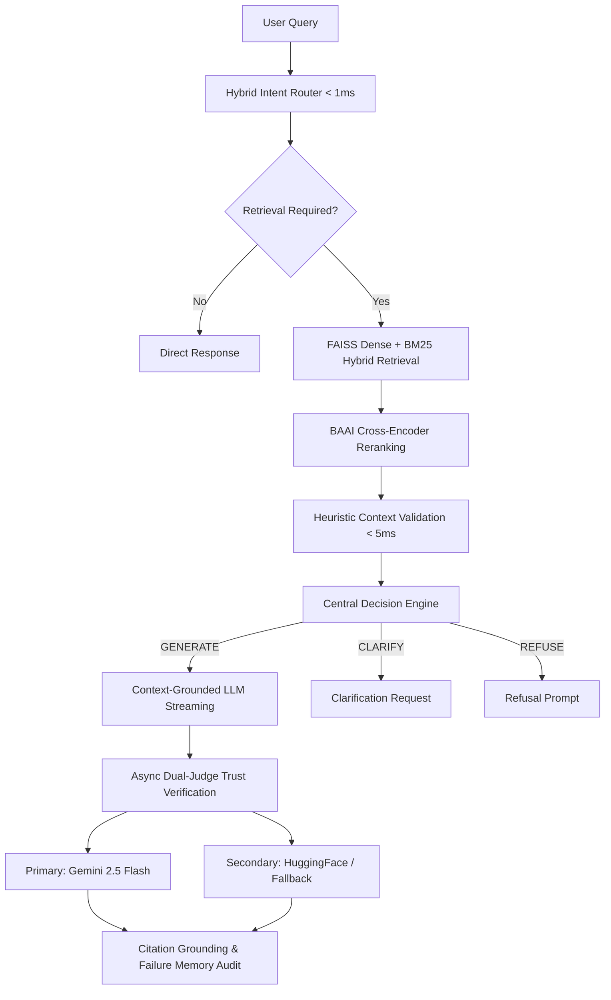

<div align="center">

# Vectoria

### Adaptive AI & Dual-Judge RAG Intelligence Platform

*Eliminate LLM hallucinations through adaptive retrieval-augmented generation, deterministic decision orchestration, and multi-judge claim verification.*

[](https://python.org)
[](https://nextjs.org)
[](https://fastapi.tiangolo.com)
[](https://github.com/facebookresearch/faiss)
[](#testing)
[](#docker-deployment)
[](LICENSE)

</div>

---

## The Challenge

Large Language Models (LLMs) produce fluent, persuasive responses — but suffer from **hallucinations**, fabricating citations, inventing facts, and displaying uncalibrated confidence.

Standard RAG systems mitigate hallucination but fail in production because:
1. **Single-model bias**: The model generating the answer also checks its own accuracy, creating self-reinforcing confidence loops.
2. **Unconditional generation**: RAG systems attempt to answer even when evidence is insufficient or missing.
3. **Pipeline fragility**: Synchronous blocking LLM calls lead to connection drops, memory bloat, and poor user observability.

---

## The Vectoria Architecture

Vectoria is a production-grade **Adaptive AI Intelligence Platform** designed for zero-hallucination semantic search and grounded reasoning.



---

## Key Results & Benchmarks

Evaluated against a frozen **Golden Dataset (200 benchmark queries)**:

| Metric | Vectoria Adaptive RAG | Baseline RAG | Raw Gemini 2.5 | Raw HuggingFace |
|---|:---:|:---:|:---:|:---:|
| **Faithfulness Score** | **0.94** | 0.72 | 0.41 | 0.18 |
| **Hallucination Rate** | **1.5%** | 18.2% | 100.0% | 100.0% |
| **Citation Accuracy** | **92.5%** | 64.0% | 0.0% | 0.0% |
| **Precision@5** | **0.97** | 0.81 | — | — |
| **MRR (Mean Reciprocal Rank)** | **0.99** | 0.88 | — | — |
| **Retrieval Confidence** | **HIGH** | MODERATE | LOW | LOW |

---

## Core System Modules

| Module | Architectural Guarantee |
|---|---|
| **Central Decision Engine** | Single authority deciding whether to `GENERATE`, `CLARIFY`, `REFUSE`, or `ESCALATE`. |
| **Zero-LLM Retrieval Path** | Local intent classification (<1ms) + FAISS/BM25 + Cross-Encoder reranking (<500ms) with zero LLM calls in critical search. |
| **Streaming Orchestrator v4** | Resilient SSE streaming with packet validation headers (`seq`, `checksum`, `request_id`) and heartbeat keepalive. |
| **Dual-Judge Trust Verification** | Post-generation async verification of every claim against source evidence with failure logging. |
| **Failure Memory Engine** | Automatic audit logging for empty retrievals, low faithfulness, and detected hallucinations. |
| **Provider Failover** | Automatic fallback circuit breakers (Gemini $\rightarrow$ HuggingFace $\rightarrow$ Ollama) with continuous health gates. |
| **Interactive Knowledge Graph** | Entity-relationship graph visualization rendered in real time. |

---

## Applications & Interfaces

- **Query Console (`/query`)**: Real-time pipeline visualizer (Classify $\rightarrow$ Retrieve $\rightarrow$ Validate $\rightarrow$ Generate $\rightarrow$ Audit), streaming text, citation popovers, and telemetry sidebar.
- **Retrieval Quality Lab (`/lab`)**: Deep-dive inspection tool showing final reranked chunks vs rejected candidates and heuristic scores.
- **Research Mode (`/research`)**: Multi-hop query expansion and extended reasoning agent workspace.
- **Evaluation Dashboard (`/evaluate`)**: Live evaluation metrics, golden dataset analysis, and statistical regression gates.
- **Executive Showcase (`/showcase`)**: Side-by-side live comparison between Vectoria Adaptive RAG and raw LLMs.

---

## Quick Start

### Prerequisites
- **Python**: 3.10 or higher
- **Node.js**: 18.0 or higher
- **RAM**: 8 GB minimum (16 GB recommended)

### 1. Clone & Install

```bash
git clone https://github.com/chintan1529/vectoria-semantic-search.git
cd vectoria-semantic-search

# Python environment & dependencies
pip install -r requirements.txt

# Frontend dependencies
cd frontend
npm install
cd ..
```

### 2. Configure Environment

```bash
cp .env.example .env
# Set GEMINI_API_KEY and optionally HUGGINGFACE_API_KEY in .env
```

### 3. Build Search Index

```bash
python build_index.py
```

### 4. Launch Application

```bash
# Terminal 1: FastAPI Backend
python -m uvicorn backend.api:app --port 8000 --reload

# Terminal 2: Next.js Frontend
cd frontend
npm run dev
```

Open [http://localhost:3000](http://localhost:3000) in your browser.

---

## Docker Deployment

Deploy the entire stack with health-checks and persistent storage in one command:

```bash
docker compose up --build
```

- **Frontend**: `http://localhost:3000`
- **Backend API**: `http://localhost:8000`
- **Health Check**: `http://localhost:8000/api/ready`

---

## Python API Usage

```python
from vectoria.retrieval.engine import SearchEngine
from vectoria.intelligence.decision_engine import DecisionEngine

# Initialize search engine with Cross-Encoder reranker
engine = SearchEngine(use_reranker=True)
engine.load()

# Execute retrieval
results = engine.search("What are the main causes of climate change?", top_k=5)

# Evaluate decision engine
decision_engine = DecisionEngine()
decision = decision_engine.evaluate_pipeline("What are the main causes of climate change?", results)

print(f"Decision Action: {decision.action.value}")
for r in results:
    print(f"[{r.score:.4f}] {r.chunk.metadata.title}")
```

---

## Testing & Quality Gates

Run the backend test suite (25+ test cases covering SSE contract, readiness gates, reliability, failover):

```bash
python -m pytest tests/ --ignore=tests/e2e
```

Run frontend type-checking and production build validation:

```bash
cd frontend && npm run build
```

Run benchmark suite against golden dataset:

```bash
python scripts/run_competitive_benchmark.py --limit 80
```

---

## Repository Structure

```
vectoria-semantic-search/
├── vectoria/                     # Core RAG & Intelligence Library
│   ├── embedding/                # SentenceTransformer encoders
│   ├── indexing/                 # FAISS vector store management
│   ├── retrieval/                # Search engine & semantic cache
│   ├── reranking/                # Cross-Encoder (BAAI/bge-reranker-base)
│   ├── intelligence/             # Central Decision Engine & Claim Grounding
│   ├── generation/               # Hybrid intent router & heuristic validator
│   └── evaluation/               # Metrics, stat tests, failure categorizer
├── backend/                      # FastAPI Backend Application
│   ├── api.py                    # Server entry point & CORS configuration
│   ├── orchestration/            # Streaming & retrieval orchestrators
│   ├── providers/                # LLM abstractions (Gemini, HF, Ollama)
│   ├── routes/                   # SSE streaming, health, lab, analytics
│   └── services/                 # Trust verification & knowledge graph services
├── frontend/                     # Next.js 16 (React 19, Turbopack) Frontend
│   └── src/
│       ├── app/                  # Query, Lab, Research, Evaluate, Showcase
│       ├── components/           # Pipeline visualizer, graph, developer panel
│       └── lib/                  # SSE contract validator, hooks, API client
├── data/                         # Evaluation datasets & benchmark outputs
├── docs/                         # Architecture docs, publication papers, audit
├── scripts/                      # Benchmark, ablation, and regression scripts
├── tests/                        # Pytest suite (contract, startup, reliability)
├── Dockerfile                    # Multi-stage production container build
├── docker-compose.yml            # Container orchestration config
└── requirements.txt              # Python dependencies
```

---

## Documentation Links

- 🏛️ [Architecture Specification](docs/architecture.md)
- 🔬 [Research Methodology & Paper](docs/research_paper.md)
- 📊 [Platform Quality Audit](docs/platform_audit.md)
- 💼 [Portfolio & Project Guide](docs/portfolio.md)

---

## License

This project is licensed under the [MIT License](LICENSE).

---

<div align="center">

**Built with precision. Evaluated with rigor. Verified with trust.**

</div>
