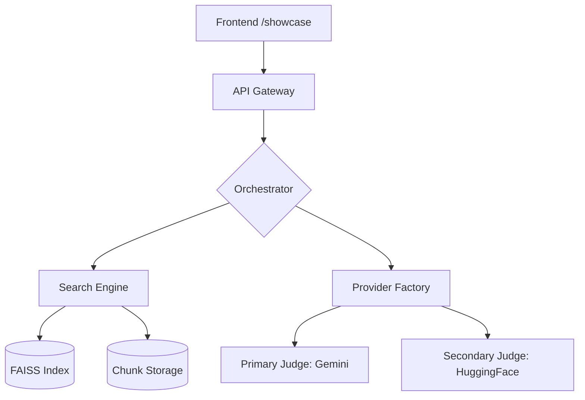
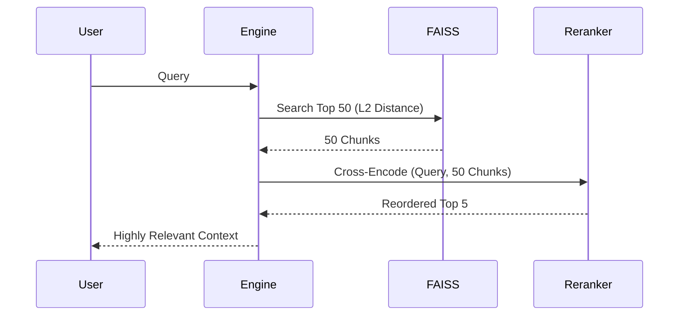
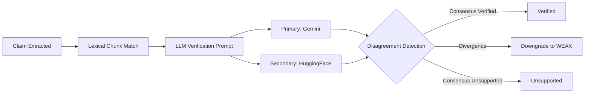
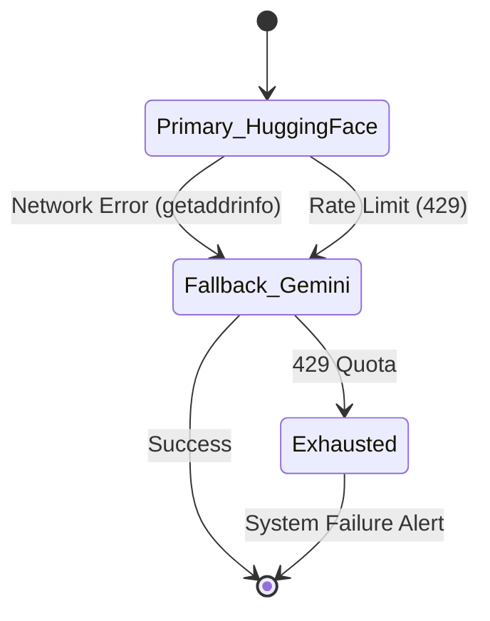

# Vectoria Platform Architecture

Vectoria is a mature, dual-judge RAG intelligence platform designed to eliminate LLM hallucinations through semantic retrieval, deterministic citation mapping, and rigorous evaluation architectures.

## System Architecture

## Retrieval & Reranking Flow

## Dual-Judge Trust Verification Architecture

The evaluation pipeline guarantees answer faithfulness by splitting the validation step between two isolated inference engines.

## Provider Failover Architecture

